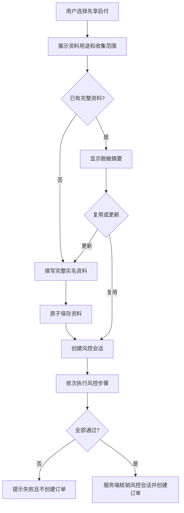

# iOS App 审核整改设计说明

- **日期：** 2026-08-10
- **适用版本：** iOS App 1.0 后续整改版本
- **审核问题：** App Store Review Guideline 5.1.1(v)
- **文档状态：** 已批准，可据此编写实施计划和代码

## 1. 背景与拒审结论

Apple 在 Submission ID `57e41734-eb99-43b9-bc7e-b7669cf29d55` 的审核中指出两项问题：

1. 注册阶段强制收集身份证号、身份证照片和紧急联系人，但这些信息并非账号注册和普通购物的必要条件。
2. App 支持创建账号，但没有在 App 内发起并完成账号注销的入口。

问题本质不是这些资料永远不能收集，而是收集时机、适用业务和用户控制权不符合最小必要原则。整改后的 iOS App 必须把“创建商城账号”和“主动申请先享后付”拆成两个独立阶段，并提供完整的应用内账号注销流程。

## 2. 目标与非目标

### 2.1 目标

- 只整改原生 iOS App，解决 Guideline 5.1.1(v) 指出的注册资料和账号注销问题。
- iOS 注册只要求手机号、短信验证码和密码。
- 身份证和紧急联系人只在用户主动选择先享后付后收集。
- 通讯录只在先享后付订单审核通过、合同签署前请求。
- iOS 18 及以上支持有限联系人授权，只上传系统实际授权的数据。
- 在 iOS App 内提供不依赖客服的账号注销流程。
- 保持 H5 和 Android 的页面、接口、校验和线上数据行为不变。
- 不执行数据库迁移、历史数据回填、批量更新或批量删除。

### 2.2 非目标

- 本设计不修改 H5 或 Android 的现有注册和订单流程。
- 本设计不重构现有通用注册、下单、卡包或合同接口。
- 本设计不建立审核账号专用逻辑、审核期远程开关或审核后 OTA 恢复机制。
- 本设计不改变现有订单审核、还款、财务或管理后台业务规则。
- 本设计不提供绕过 Apple 隐私政策的技术方案。

## 3. 已确认约束

### 3.1 平台边界

| 运行平台 | 注册 | 下单 | 卡包/合同 | 个人中心 |
| --- | --- | --- | --- | --- |
| iOS 原生 App | 新增 iOS 独立实现 | 新增 iOS 独立分支 | 新增 iOS 独立分支 | 新增账号与安全入口 |
| Android 原生 App | 保持现状 | 保持现状 | 保持现状 | 保持现状 |
| H5/Web | 保持现状 | 保持现状 | 保持现状 | 保持现状 |

平台判断只有一个来源：

```ts
Capacitor.isNativePlatform() && Capacitor.getPlatform() === 'ios'
```

不得使用 User-Agent、域名、手机号、审核账号、App Review 来源、服务端审核状态或时间窗口判断 iOS 整改流程。

### 3.2 数据边界

- 不增加数据库迁移脚本。
- 不扫描或改写历史用户。
- 不在 API 启动时自动补字段。
- 不创建面向全库的清理任务。
- 测试不得连接生产 MongoDB、生产 OSS 或生产短信服务。
- 只有当前用户主动执行的 iOS 注册、实名资料提交、正常下单、联系人授权上传和账号注销可以产生业务写入。
- 代码回滚不执行数据库反向迁移。

## 4. 当前实现事实

现有 iOS、Android 和 H5 共用以下核心实现：

- 注册组件：`2.shop/src/components/auth/RegisterForm.vue`
- 注册接口：`POST /auth/register`，位于 `1.api/src/index.js`
- 下单组件：`2.shop/src/components/order/create.vue`
- 通讯录和合同入口：`2.shop/src/components/my/CardPackageSection.vue`
- iOS 联系人插件：`2.shop/ios/App/App/MallContactsPlugin.swift`
- 通讯录后端模块：`1.api/src/mallContacts/`

现有注册接口强制校验姓名、身份证号和两位紧急联系人，因此不能直接放宽 `/auth/register`，否则会同时改变 H5 和 Android 的线上行为。现有 Swift 插件已经识别 iOS 18 的 `.limited` 权限状态，整改时保留该能力，不重写联系人插件。

页面壳层 `MallRegisterView.vue`、`MallOrderCreateView.vue`、`MallCardPackageView.vue` 和 `MallMyView.vue` 仅负责挂载核心组件，适合增加平台分发而不修改旧组件内部业务。

## 5. 总体架构

```mermaid
flowchart TD
    A[页面薄壳] --> B{原生 iOS?}
    B -- 否 --> C[现有 H5/Android 组件]
    B -- 是 --> D[iOS 独立组件目录]
    C --> E[现有默认 API]
    D --> F[/ios/* 独立 API]
    F --> G[现有底层短信/风控/存储能力]
    E --> H[现有线上业务数据]
    G --> H
```

### 5.1 前端结构

iOS 新组件统一放在 `2.shop/src/components/ios/`，iOS API 调用统一放在 `2.shop/src/api/modules/iosMall.ts`。薄壳页面只做平台选择：iOS 加载新组件，其他平台加载现有组件。

允许修改共享文件的范围仅包括：

- 四个页面薄壳的平台分发；
- 新增统一的 iOS 原生平台判断工具；
- `runAppOtaCheck()` 增加 iOS 原生平台直接退出条件。

现有核心组件和默认 API 调用不得加入 iOS 条件分支。

### 5.2 后端结构

后端新增 `1.api/src/ios/`，通过独立路由注册函数接入 `1.api/src/index.js`。模块通过依赖注入使用现有的短信、风控、订单持久化、联系人存储和密码验证能力，不复制生产连接配置，也不改变原路由处理函数。

新接口统一使用 `/ios/*` 前缀。现有 `/auth/register`、`/orders`、`/mall/contacts/*` 和合同接口的默认契约保持不变。

### 5.3 身份与审计

- 继续使用现有 Bearer 登录身份。
- 服务端只从令牌解析当前用户，不采信请求体、路径外参数或查询参数中的手机号。
- 日志只记录用户内部 ID、订单 ID、接口、结果码和耗时。
- 日志不得记录密码、完整手机号、身份证号、照片 URL、联系人姓名或联系人手机号。
- iOS 请求可附带 `X-Client-Platform: ios-native` 和 App 版本用于日志分析，但该请求头不能替代认证或授权。

## 6. iOS 用户流程

### 6.1 注册

1. 用户打开 iOS 注册页。
2. 页面只显示手机号、短信验证码、密码和确认密码。
3. 用户阅读并同意适用于账号注册的协议。
4. App 调用 `POST /ios/auth/register`。
5. 注册成功后建立现有商城登录状态。

注册请求不得包含姓名、身份证号、身份证图片、位置、紧急联系人或通讯录数据。服务端也不得在注册成功后立即弹出实名资料页。

### 6.2 普通购物

浏览、收藏、地址管理和全款购买均不得要求实名资料、紧急联系人或通讯录权限。全款购买继续使用现有订单能力，但由 iOS 独立页面明确保持“无需先享后付资料”的行为。

### 6.3 先享后付申请



资料包括：

- 姓名；
- 身份证号；
- 身份证正面；
- 身份证反面；
- 手持身份证；
- 两位紧急联系人的姓名和手机号。

首次必须完整提交。后续查询只返回脱敏摘要和三张图片是否存在；用户更新时重新提交完整资料，服务端一次性校验、一次性写入，不允许部分字段先落库。

风控步骤全部通过前不得创建订单。风控失败、超时、页面退出、会话过期或最后一步未完成时，数据库中都不得出现该次申请对应的订单。

### 6.4 通讯录和合同

通讯录权限请求必须同时满足：

1. 当前运行环境为原生 iOS；
2. 当前用户已登录；
3. 订单属于当前用户；
4. 订单为先享后付；
5. 后台已审核通过；
6. 合同尚未签署；
7. 用户主动点击继续签署。

请求权限前显示系统授权前置说明，说明用途、上传字段和有限授权能力。iOS 18 及以上由系统允许用户选择部分联系人；App 只读取和上传系统返回的联系人。联系人经手机号规范化和去重后至少保留一条有效记录。

用户拒绝、取消或系统未返回有效联系人时：

- 不调用上传完成接口；
- 不写入空的“已授权”状态；
- 不进入合同签署；
- 保留“重新授权”和“退出”操作；
- 不显示诱导用户授予完全访问的文案。

### 6.5 账号注销

入口固定为“我的 → 账号与安全 → 注销账号”。流程如下：

1. App 查询注销资格，不产生数据写入。
2. 页面展示不能注销的进行中业务，或展示删除和法定保留说明。
3. 用户输入当前登录密码。
4. 用户在最终确认弹窗中明确确认永久注销。
5. 服务端重新验证身份、密码和注销资格。
6. 服务端仅处理当前账号的数据。
7. 成功后 App 清除本地登录状态和缓存并返回登录页。

不得用停用、冻结或退出登录替代账号注销。不得要求用户打电话、发邮件或联系客服完成注销。

## 7. iOS API 契约

所有接口沿用 `{ success, data, msg }` 外壳。业务错误同时返回稳定的 `code`，前端按 `code` 展示受控文案，不解析中文消息决定流程。

| 方法 | 路径 | 作用 | 是否写数据 |
| --- | --- | --- | --- |
| POST | `/ios/auth/register/sms/send` | 发送 iOS 注册验证码 | 短信验证码状态 |
| POST | `/ios/auth/register` | 简化注册 | 新用户 |
| POST | `/ios/uploads/id-card` | 上传先享后付身份证图片 | OSS 对象 |
| GET | `/ios/installment/profile` | 返回资料完整度和脱敏摘要 | 否 |
| PUT | `/ios/installment/profile` | 原子保存完整资料 | 当前用户 |
| POST | `/ios/installment-risk/wave` | 创建 iOS 风控会话 | 风控会话/现有尝试状态 |
| POST | `/ios/installment-risk/wave/:waveId/step/:stepKey` | 执行单个风控步骤 | 风控会话 |
| POST | `/ios/installment/orders` | 风控通过后创建订单 | 新订单 |
| POST | `/ios/orders/:orderId/contacts/upload/start` | 创建联系人上传会话 | 上传会话 |
| POST | `/ios/orders/:orderId/contacts/upload/batch` | 上传授权联系人 | 当前上传批次 |
| POST | `/ios/orders/:orderId/contacts/upload/complete` | 完成上传并关联订单 | 当前订单/用户摘要 |
| GET | `/ios/account/deletion-eligibility` | 查询注销资格 | 否 |
| POST | `/ios/account/delete` | 密码确认后注销账号 | 当前账号相关数据 |

稳定错误码：

- `IOS_PROFILE_INCOMPLETE`
- `IOS_RISK_NOT_PASSED`
- `IOS_CONTACTS_REQUIRED`
- `IOS_CONTACTS_PERMISSION_DENIED`
- `ORDER_NOT_OWNED`
- `ORDER_NOT_ELIGIBLE_FOR_CONTRACT`
- `INVALID_CURRENT_PASSWORD`
- `ACCOUNT_HAS_ACTIVE_BUSINESS`

## 8. 数据生命周期

### 8.1 注册资料

iOS 注册只新增现有商城用户记录和密码哈希。未申请先享后付的 iOS 用户不应具有身份证、照片或紧急联系人数据。

### 8.2 实名资料

实名资料只写入现有用户字段：

- `name`
- `idNumber`
- `idCardFront`
- `idCardBack`
- `idCardHandheld`
- `emergencyContacts`

资料完整度在读取时动态计算，不新增需要回填的 `profileComplete` 字段。图片 URL 不通过资料查询接口返回给前端，只返回对应的 `has*` 布尔值。

### 8.3 通讯录

- 上传记录必须关联当前用户和指定订单。
- 只保存联系人显示名称、规范化手机号和现有去重标识所需字段。
- 不保存无手机号的联系人。
- 不上传通讯录备注、地址、生日、邮箱或头像。
- 不把紧急联系人自动扩展为通讯录授权，也不把通讯录授权反向覆盖紧急联系人。

### 8.4 账号注销数据处理

| 数据类别 | 无需法定留存 | 存在已结清历史业务 |
| --- | --- | --- |
| 用户登录记录 | 删除 | 删除 |
| 手机号、密码、身份证、照片 | 删除 | 删除 |
| 地址、银行卡 | 删除 | 删除 |
| 通讯录上传记录和批次 | 删除 | 删除 |
| 未形成交易的临时数据 | 删除 | 删除 |
| 已结清交易/账务 | 不适用 | 去标识化后保留 |
| 已签合同 | 不适用 | 按法务批准范围受限保留 |

存在待审核、待发货、待收货、未签合同、未结清分期、待还账单或其他进行中业务时，返回 `ACCOUNT_HAS_ACTIVE_BUSINESS`，不执行任何删除或匿名化。

无依法保留记录时返回 `hard_deleted`。仅存在已结清历史业务时返回 `anonymized_with_legal_retention`。默认留存天数通过 `IOS_ACCOUNT_LEGAL_RETENTION_DAYS=1825` 配置，生产启用前必须取得法务对期限和字段范围的书面批准。

本设计不新增全库定时清理。账号注销只处理发起操作的当前账号；法定期限届满后的归档清理由正式的数据留存制度承担。

## 9. iOS 原生隐私配置

`Info.plist` 使用以下用途说明：

```text
NSContactsUsageDescription
仅当您主动申请先享后付且订单审核通过后，用于读取并上传您在系统中选择授权的联系人姓名和手机号，以完成合同签署前的订单安全核验。您可以在系统中只选择部分联系人。

NSCameraUsageDescription
用于拍摄身份证正反面和手持身份证照片，以完成您主动申请的先享后付实名核验。

NSPhotoLibraryUsageDescription
用于从相册选择身份证资料，以完成您主动申请的先享后付实名核验。
```

还必须审计 `PrivacyInfo.xcprivacy`、Capacitor 和第三方 SDK 的隐私清单，并在 App Store Connect 的 App Privacy 中如实申报联系方式、标识符、用户内容/照片、联系人和购买/交易数据。不得把这些数据声明为“未收集”或用“非跟踪”掩盖实际业务收集。

## 10. OTA 与审核一致性

`runAppOtaCheck()` 在原生 iOS 上直接返回，iOS 审核版本只运行随 App Store 构建提交的 Web 资源。Android 继续使用现有 OTA 逻辑。

禁止以下行为：

- 针对 Apple 审核账号隐藏资料收集；
- 审核通过后远程恢复旧注册页；
- 用服务端开关让同一 iOS 构建在审核前后表现不同；
- 用 H5 跳转绕过应用内账号注销。

## 11. 安全与失败处理

- 资料更新先完整校验，再单次持久化；失败时不保留半套资料。
- 风控会话必须绑定用户，不能跨用户核销。
- 订单创建必须在服务端重新验证资料完整性和风控结果。
- 联系人上传必须检查订单归属、审核状态和合同状态。
- 注销密码必须使用现有密码哈希验证，不接受前端“已验证”标志。
- 删除图片时只处理当前用户资料中解析出的私有对象键，禁止使用前缀或通配符批量删除。
- 任何上游超时都返回失败，不得以默认通过继续创建订单或开放合同。

## 12. 上线与回滚原则

1. 先发布只增加 `/ios/*` 的后端代码，保持旧接口不变。
2. 在测试环境使用假短信、测试 OSS 和测试数据库验证。
3. 通过 TestFlight 在物理 iPhone 上完成注册、资料、风控、审核、有限联系人授权、合同和注销全链路。
4. 核对 App Privacy、隐私政策、审核备注和录屏后提交新的 iOS 构建。
5. 已发布 iOS 构建依赖的新接口不得直接删除；异常时先恢复兼容后端，再提交新的 iOS 修复版本。
6. 回滚只回滚代码，不执行数据库反向迁移或历史数据批量处理。

## 13. 验收标准

- iOS 注册页面和请求中不存在身份证、照片、姓名和联系人字段。
- H5 和 Android 仍加载原组件并调用原接口。
- iOS 普通购物不触发实名或通讯录权限。
- 只有选择先享后付后才收集实名资料。
- 风控未全部通过时不创建订单。
- 通讯录只在订单审核通过、合同签署前请求。
- iOS 18+ 有限授权可只上传用户选择的联系人。
- 用户可以在 App 内发起并完成账号注销。
- 注销仅影响当前账号，进行中业务会阻止注销。
- 没有数据库迁移、历史回填、批量更新或生产测试连接。
- 不存在审核专用开关或 iOS OTA 恢复旧流程。

## 14. 再次拒审时的处理

如果 Apple 仍明确认定紧急联系人或通讯录不能作为先享后付服务的必要步骤，不继续通过文案、延迟弹窗或审核账号差异规避。下一 iOS 版本直接隐藏先享后付入口，只保留普通浏览和全款购买；H5 和 Android 是否调整由独立产品决策处理。
